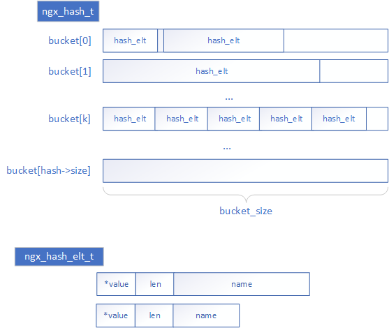

# 简介
相关文件: core/ngx_hash.c、core/ngx_hash.h

ngx_hash是nginx中的hash表结构，具有以下特点：
- 静态结构，hash表创建后无法动态添加/删除KV。
- 采用连续存储方式解决碰撞问题。即出现碰撞的KV存放在连续地址。
- 支持前缀和后缀通配符匹配。

以上特点决定了其高效性与功能局限性。

# 内存结构



整个hash表结构分成若干个bucket，每个bucket内存放key值碰撞的元素。

- 每个bucket的大小是初始化时指定的一个值(bucket_size)，要求大于最大元素的大小。即bucket_size约束了元素的大小。但实际的桶大小还要根据各种信息具体确定，详见下文初始化部分。
- bucket的数量时初始化时根据各种信息计算得到，详见下文初始化部分。

每个元素内保存了完整的key值，注意ngx_hash_elt_t.name实际存储的内容包括完成的key，不仅是1个字节，len表示其真实长度。所以每个元素的大小是不一致的，根据key的实际长度决定。

**代码参考**

- core/ngx_hash.h: ngx_hash_elt_t
- core/ngx_hash.h: ngx_hash_t
- core/ngx_hash.c: ngx_hash_find()

# 初始化表

初始化表的入口`ngx_hash_init()`函数，其中参数`names`和`nelts`组成一组key不重复的KV集合。

nginx提供了一组函数`ngx_hash_keys_array_init()`和`ngx_hash_add_key()`用于创造不重复的KV集合列表，原理是通过一个简易的链状hash进行重复检查。

**代码参考**

- core/ngx_hash.h: ngx_hash_init_t
- core/ngx_hash.h: ngx_hash_key_t
- core/ngx_hash.c: ngx_hash_init()
- core/ngx_hash.c: ngx_hash_keys_array_init()
- core/ngx_hash.c: ngx_hash_add_key()


# 关于通配符支持

nginx支持3种形式的通配符匹配。

- `.example.com`可以匹配`example.com`和`www.example.com`
- `*.example.com` 只可以匹配`www.example.com`不能匹配`example.com`
- `www.example.*`可以匹配`www.example.com`

内部是使用3张hash表分别保存精确匹配、头部统配、尾部统配。再查找是也区分精确查找、头部统配查找、尾部统配查找。

关于在前缀表和后缀表种如何查找，需要先了解前缀表和后缀表的结构。

为了查找方便，特别是为了实现头部匹配表的查找，对于3中统配形式会进行一定的变化。

- `.example.com`形式的通配符会在 精确表中加入`example.com` 在头部匹配中加入`com.example`。
- `*.example.com`形式的通配符会在头部匹配中加入`com.example.`
- `www.example.*`形式的通配符会在尾部匹配中加入`www.example`

处理后都就能实现成从左到右分段匹配。处理代码详见`ngx_hash_add_key()`函数的`wildcard:`部分该部分有注释，比较好读。

进行初步处理后，就要开始构造分段的hash结构了，相关代码在`ngx_hash_wildcard_init()`。

示例有以下三个处理后的统配符号和对应的value

``` text
{
  www.aaa.com  : X1,
  img.aaa.com  : X2,
  www.bbb.com. : X3,
}
```

将保存成形如这样的结构

``` text
{
  www : {
    aaa : {
      com : X1
    },
    bbb : {
      com : X2
    }
  },
  img : {
    bbb : {
      com : X3
    }
  }
}
```

**代码参考**

- core/ngx_hash.h: ngx_hash_combined_t
- core/ngx_hash.h: ngx_hash_wildcard_t
- core/ngx_hash.c: ngx_hash_wildcard_init()
- core/ngx_hash.c: ngx_hash_find_combined()
- core/ngx_hash.c: ngx_hash_find_wc_head()
- core/ngx_hash.c: ngx_hash_find_wc_tail()

