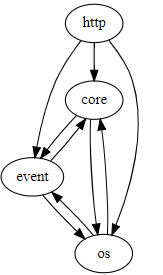
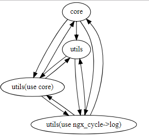
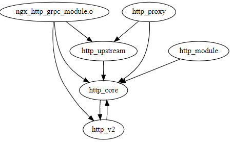

本文目的主要从宏观层面分析nginx源码，对nginx源码文件进行分类，并分析其依赖关系，帮助理解nginx源码宏观结构。对阅读源码起指引作用


# 源码目录

```
src
├── core
├── os
│   └── unix
├── event
│   └── modules
├── http
│   ├── modules
│   │   └── perl
│   └── v2
├── mail
├── stream
└── misc
```

这几个目录间的依赖关系如下：



我们可以看出几点

- core、os、event是nginx的核心而且3个目录之间的代码都有循环依赖
- http、mail、stream3类模块依赖于底层模块，不存在反向依赖
- core与os目录的定位都是底层模块，os包括各类系统兼容的处理
- core与os中的文件可以再大致的区分为2类
  - 基础库封装，互相之间依赖较少、没有复杂的处理流程。例如ngx_array、ngx_md5、ngx_palloc、ngx_rbtree等等
  - nginx基础流程，包括启动流程、进程管理、模块管理等等。典型文件包括nginx、ngx_cycle、ngx_process_cycle等等


# core与os文件分类



我将core与os2个文件夹下的文件进行了一个简单的分类

- core 核心流程，需要重点研究
- utils 基础库，供核心流程使用，不影响核心流程
- utils(use ngx_cycle->log)基础库，但是为了调试，使用到了ngx_cycle->log变量，可以简单与utils放在一起。
- utils(use core) 会影响到核心流程，或受核心流程影响的几个库，主要体现是使用到了一些定义状态的全局变量。
- 后2类文件如果能将其与core解耦的话就更好了。
- 具体分类如下

```json
"core": {
    "files": [
        "ngx_process_cycle.o",
        "ngx_cycle.o",
        "ngx_module.o",
        "nginx.o"
    ]
},
"utils": {
    "files": [
        "ngx_setaffinity.o",
        "ngx_errno.o",
        "ngx_linux_sendfile_chain.o",
        "ngx_time.o",
        "ngx_send.o",
        "ngx_readv_chain.o",
        "ngx_recv.o",
        "ngx_md5.o",
        "ngx_radix_tree.o",
        "ngx_palloc.o",
        "ngx_spinlock.o",
        "ngx_rwlock.o",
        "ngx_sha1.o",
        "ngx_queue.o",
        "ngx_times.o",
        "ngx_rbtree.o",
        "ngx_parse.o",
        "ngx_array.o",
        "ngx_proxy_protocol.o",
        "ngx_buf.o",
        "ngx_regex.o",
        "ngx_list.o",
        "ngx_crypt.o",
        "ngx_alloc.o",
        "ngx_channel.o",
        "ngx_dlopen.o",
        "ngx_shmem.o",
        "ngx_udp_sendmsg_chain.o",
        "ngx_udp_send.o",
        "ngx_writev_chain.o",
        "ngx_user.o",
        "ngx_socket.o",
        "ngx_udp_recv.o",
        "ngx_linux_init.o",
        "ngx_file.o",
        "ngx_inet.o",
        "ngx_resolver.o",
        "ngx_output_chain.o",
        "ngx_files.o",

        "ngx_parse_time.o",
        "ngx_murmurhash.o",
        "ngx_cpuinfo.o"
    ]
},
"utils(use ngx_cycle->log)": {
    "files": [
        "ngx_shmtx.o",
        "ngx_crc32.o",
        "ngx_hash.o",
        "ngx_process.o",
        "ngx_setproctitle.o",
        "ngx_slab.o",
        "ngx_syslog.o",
        "ngx_open_file_cache.o",
        "ngx_string.o"
    ]
},
"utils(use core)": {
    "files": [
        "ngx_log.o",
        "ngx_connection.o",
        "ngx_conf_file.o",
        "ngx_posix_init.o",
        "ngx_daemon.o"
    ]
}
```

# HTTP文件分析



http目录下的文件搭建了一套http的处理框架，不仅能高效支持http请求处理，还能使用定义的接口对http处理进行扩展。

- http_core是HTTP模块的核心，包括了处理框架和流程机制。http2的支持其实也可以归并到这个类别中
- http_module是常见的扩展，可以座位自定义模块的参考
- http_upstream与http_proxy是2类常见的与后端相关的扩展模块

- ngx_http_grpc_module本想归类在http_proxy中的，由于其特殊性直接依赖了http_v2的部分功能，所以单独列出。
- 具体分类方式如下:

```json
"http_core": {
    "files": [
        "ngx_http.o",
        "ngx_http_request.o",
        "ngx_http_variables.o",
        "ngx_http_request_body.o",
        "ngx_http_core_module.o",
        "ngx_http_file_cache.o",
        "ngx_http_script.o",
        "ngx_http_parse.o",
        "ngx_http_postpone_filter_module.o",
        "ngx_http_special_response.o",
        "ngx_http_ssl_module.o"
    ]
},
"http_proxy": {
    "files": [
        "ngx_http_proxy_module.o",
        "ngx_http_scgi_module.o",
        "ngx_http_fastcgi_module.o",
        "ngx_http_uwsgi_module.o",
        "ngx_http_memcached_module.o"
    ]
},

"http_upstream": {
    "files": [
        "ngx_http_upstream.o",
        "ngx_http_upstream_round_robin.o",
        "ngx_http_upstream_least_conn_module.o",
        "ngx_http_upstream_ip_hash_module.o",
        "ngx_http_upstream_zone_module.o",
        "ngx_http_upstream_hash_module.o",
        "ngx_http_upstream_keepalive_module.o",
        "ngx_http_upstream_random_module.o"

    ]
},
"http_module": {
    "files": [
        "ngx_http_header_filter_module.o",
        "ngx_http_copy_filter_module.o",
        "ngx_http_userid_filter_module.o",
        "ngx_http_headers_filter_module.o",
        "ngx_http_map_module.o",
        "ngx_http_charset_filter_module.o",
        "ngx_http_index_module.o",
        "ngx_http_limit_conn_module.o",
        "ngx_http_static_module.o",
        "ngx_http_access_module.o",
        "ngx_http_auth_basic_module.o",
        "ngx_http_range_filter_module.o",
        "ngx_http_empty_gif_module.o",
        "ngx_http_not_modified_filter_module.o",
        "ngx_http_mirror_module.o",
        "ngx_http_split_clients_module.o",
        "ngx_http_try_files_module.o",
        "ngx_http_chunked_filter_module.o",
        "ngx_http_geo_module.o",
        "ngx_http_rewrite_module.o",
        "ngx_http_ssi_filter_module.o",
        "ngx_http_log_module.o",
        "ngx_http_autoindex_module.o",
        "ngx_http_gzip_filter_module.o",
        "ngx_http_limit_req_module.o",
        "ngx_http_browser_module.o",
        "ngx_http_referer_module.o",
        "ngx_http_write_filter_module.o"
    ]
},
"http_v2": {
    "files": [
        "ngx_http_v2_module.o",
        "ngx_http_v2_filter_module.o",
        "ngx_http_v2.o",
        "ngx_http_v2_encode.o",
        "ngx_http_v2_huff_decode.o",
        "ngx_http_v2_huff_encode.o",
        "ngx_http_v2_table.o"
    ]
}
```

# 代码复杂度分析

分析nginx代码中复杂度最高的几个函数，其中NLOC表示无注释的代码行数、CCN表示圈复杂度、PARAM表示函数参数个数、length表示总行数。

 ```
========================================
  NLOC  CCN  PARAM  length  location  
----------------------------------------
  588    151     1     829   ngx_init_cycle
  352    133     1     404   ngx_mail_imap_parse_command
  413    103     9     652   ngx_resolver_process_a
  599     98     2     739   ngx_http_parse_request_line
  386     89     1     537   ngx_http_v2_header_filter
  331     86     1     465   ngx_http_header_filter
  185     85     1     235   ngx_mail_smtp_parse_command
  181     85     2     263   ngx_parse_http_time
  390     83     2     523   ngx_http_ssi_body_filter
  104     82     4     142   ngx_ssl_connection_error
  274     76     1     393   ngx_event_pipe_read_upstream
  313     73     2     463   ngx_http_grpc_filter
  156     71     1     221   ngx_http_v2_push_resources
  355     69     1     486   ngx_http_fastcgi_create_request
  240     64     1     365   ngx_http_grpc_process_header
  231     63     2     341   ngx_http_upstream_send_response
  293     62     1     439   ngx_http_fastcgi_process_header
  349     60     3     494   ngx_http_proxy_merge_loc_conf
  228     60     4     343   ngx_open_cached_file
 ```

我们可以看到几点

- 解析和构造数据的函数复杂度特别高，但代码稳定，如果需要调整，需要有大量测试用例保障
- ngx_init_cycle是启动的核心流程，涉及范围广、但缺少合理封装，要仔细对待。


